## Lecture15 基于能量的光线追踪

辐射度量学可以提供更符合物理规律的量来描述光线。
并能解决：

- whitted-style光追并没有对漫反射的光线进行追踪，而是直接返回当前着色点颜色。
- Blinn-Phong模型本身就是一个不准确的经验模型，使用的这种模型的whited-style光线追踪自身自然也是不正确的

辐射度量学是对光照的一套测量系统和单位，它能够准确的描述光线的物理性质。

- Radiant Energy（辐射能量）
- Radiant flux（辐射通量）
- Radiant intensity（辐射强度）
- irradiance
- radiance

### 辐射度量学

#### Differential Solid Angle 微分立体角

#### Radiant Energy （辐射能量）

Radiant energy is the energy of electromagnetic radiation. It is measured in units of joules, and denoted by the symbol
$$
\mathrm{Q[J=J o u l e]}
$$

#### Radiant Flux / Power（辐射通量/功率）

Radiant flux (power) is the energy emitted, reflected, transmitted or received, per unit time.
$$
\Phi\equiv\frac{\mathrm{d}Q}{\mathrm{d}t}\left[\mathrm{W}=\mathrm{Watt}\right]\left[\mathrm{lm}=\mathrm{lumen}\right]^{\star}
$$

#### Radiant Intensity（辐射强度）

The radiant (luminous) intensity is the power **per unit solid angle(立体角)** emitted by a point light source.
$$
I(\omega)\equiv\frac{\mathrm{d}\Phi}{\mathrm{d}\omega}
$$

$$
\left[\frac{W}{sr}\right]\left[\frac{lm}{sr}=cd=candela\right]
$$

#### Irradiance

The irradiance is the power per unit area incident on a surface point.

irradiance是指**单位照射面积**所接收到的power。

指定了**照射表面**所受到的亮度
$$
E(\mathbf{x})\equiv\frac{\mathrm{d}\Phi(\mathbf{x})}{\mathrm{d}A}
$$

$$
\left[\frac{W}{m^{2}}\right]\left[\frac{lm}{m^{2}}=lux\right]
$$

照射面积的计算：
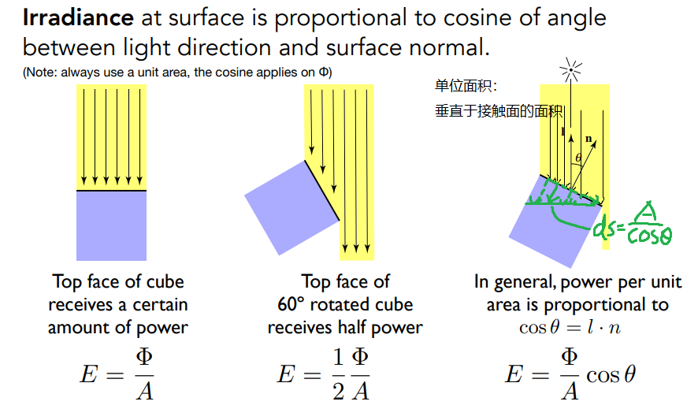
这也解释了Lambert漫反射乘以  $cos\theta$ 的原因。

能量衰减：
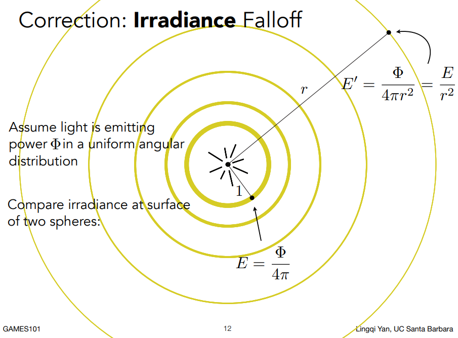

#### Radiance

$$
L(p, \omega) \equiv \frac{d^2 \phi(p, \omega)}{d\omega \, dA \cos \theta}
$$

$$
\left[ \frac{W}{sr \cdot m^2} \right] \quad \left[ \frac{cd}{m^2} \right] = \frac{lm}{sr \cdot m^2} = \text{nit}
$$

The radiance (luminance) is the power emitted, reflected, transmitted or received by a surface, **per unit solid angle**, **per projected unit area**。

Radiance是指**每单位立体角**，**每单位垂直面积**的功率。

**垂直面积：**
在irradiance中，定义的是**每单位照射面积**，而在radiance当中，为了更好的使其成为描述一条光线传播中的亮度，且在传播过程当中大小不随方向改变，所以在定义中关于接收面积的部分是**每单位垂直面积**，而这一点的不同也正解释了图中式子分母上的 $cos \theta$

**radiance和irradiance的关系：**
$$
L(p, \omega) = \frac{dE(p)}{d\omega \cos\theta}
$$

### BRDF 双向反射分布函数

BRDF理解光线的角度：一个微分面积元在接收到一定方向 $\omega_{i}$ 上的亮度 $dE(\omega_{i})$ 之后，再向不同(any other)方向$\omega_{r}$把能量辐射出去

BRDF就是描述从不同方向入射之后(from each incoming direction)，朝不同方向反射(into each outgoing direction分布情况的函数。
具体来说，BRDF为朝某个方向发出反射光radiance与入射光irrandiance的比值。

### 反射方程

$$
f(x) : 输入光源的 radiance \to  输出反射的  radiance
$$

### 渲染方程

理解渲染方程，就是在上面对反射方程的理解基础上加上自发光。
一个点光源和单个物体的场景：
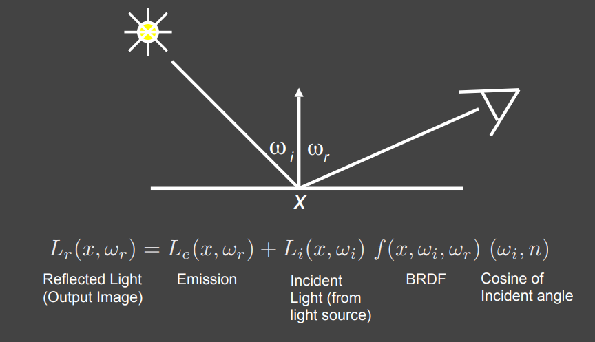
多个点光源和单个物体的场景
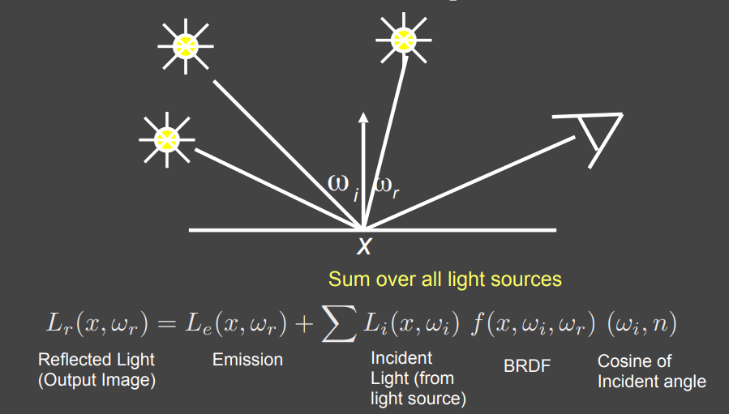
面光源：
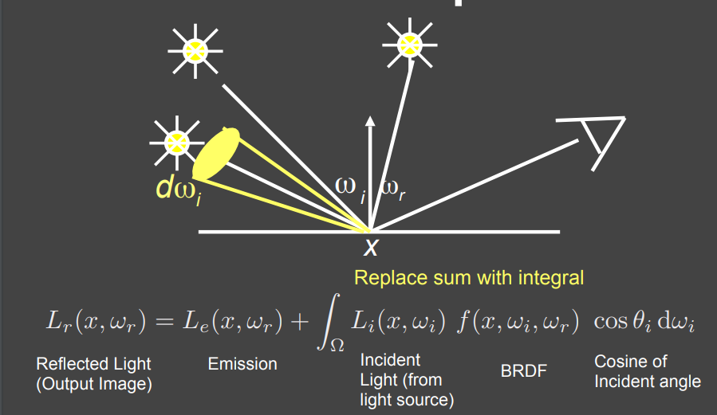
考虑其他物体的间接光照：
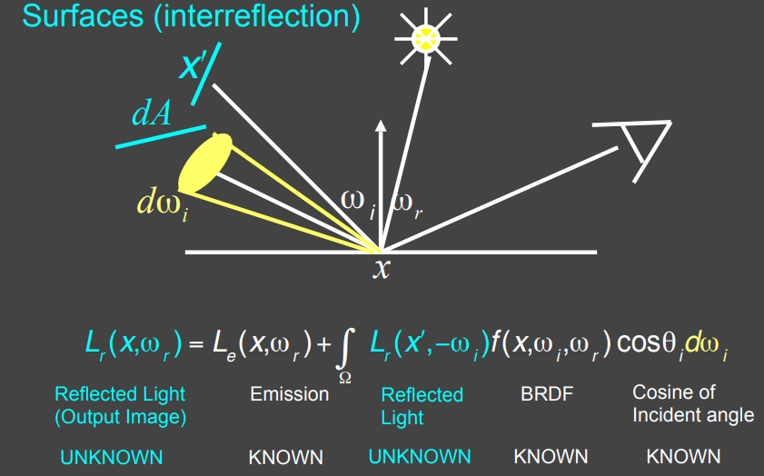
如上图所示，把其他物体同样考虑成面光源， 对其所占立体角进行积分即可，只不过对其它物体的立体角积分不像是面光源所有入射方向都有radiance，物体的立体角可能只有个别几个方向有入射的radiance(即多次物体间光线反射之后恰好照射到着色点x)，其它方向没有，但本质上都可以视作是面光源。

### 渲染方程的派生

涉及到一些数理方法的知识 有点难

## Lecture 16 蒙特卡洛积分与路径追踪

## Lecture 17 材质与外观

## Lecture 18 高级光线传播与复杂外观建模

### 高级光线传播

- 无偏的光线传播：如果无论样本多少，算出来的期望值永远是对的。例如蒙特卡洛积分，它没有系统误差。
- 有偏的光线传播：算出的期望值有一定误差的。
- 一致的光线传播：在有偏的情况下如果采样足够多的样本能够收敛到正确值。

### 无偏的光线传播方法

#### 双向路径追踪（BDPT）

之前的路径追踪是单向的，运用光源可逆性，从眼睛到光源。
BDPT双向路径追踪分别从光源和摄像机生成一系列半路径，然后再连接两个半路径的端点形成整条路径。

#### Metropolis光线传播(MLT)

用马尔科夫链做蒙特卡洛积分 
马尔科夫链是一种能在当前样本附近生成下一个样本的方法

在给定足够的时间下，可以以任意的函数为PDF生成样本，（当PDF的形状与要积分的函数形状一致时，使用蒙特卡洛积分效果最好）

优点： 

- 特别适合做复杂光路的传播

缺点： 

- 不知道收敛的速度（无法估计渲染时间）
- 局部，每个像素的效果不连贯，形成的画面很藏
- 所以不用来渲染动画

### 有偏的光线传播方法

#### 光子映射（Photon Mapping）

特别适合渲染SDS路径和caustics现象

caustics 的亮斑面积很小但亮度很高。大部分从相机射出的光线打到桌面后随机弹射根本碰不到这条特殊路径，所以那些像素长期采样值为 0。偶尔有一条碰巧走通了，一下子贡献一个很大的值，结果就是画面上该亮的地方要么黑要么突然出现一个极亮的噪点，收敛得非常慢。

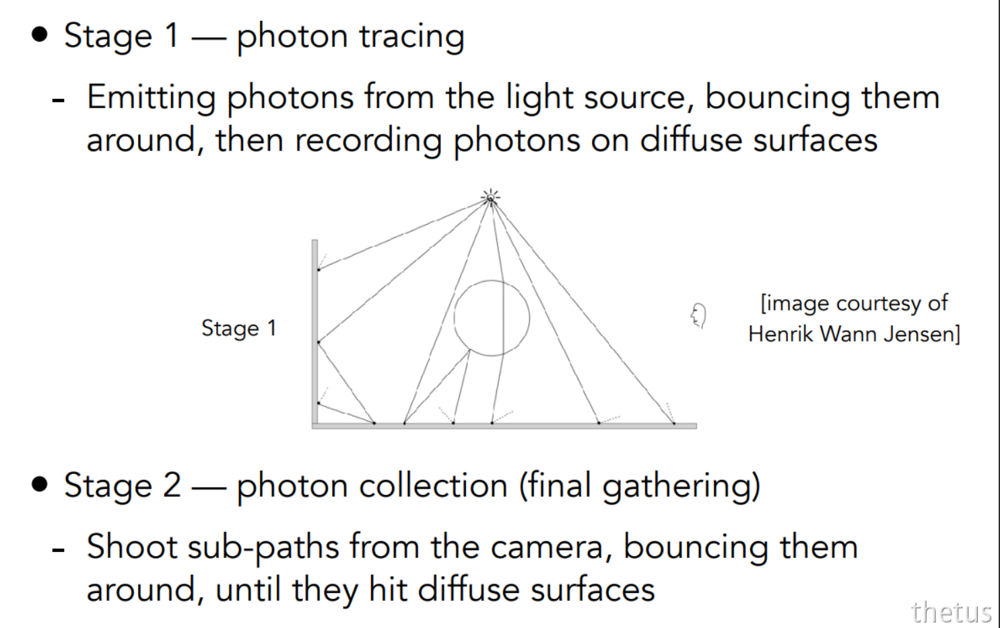

统计局部有多少个光子，来计算高光

光线追踪是纯"从眼睛找光源"，全靠采样。光子映射是"光源先撒信息，眼睛再来查"，把难采样的光路预先存下来。代价是光子映射需要额外的内存存光子图，而且密度估计如果光子不够多会产生模糊。

#### 顶点的连接与合并(VCM)

- 结合BDPT与光子映射
- 主要思想： 
    如果BDPT中的半路径的两个端点在一个平面上，不能被连接但可以被合并，我们就不要浪费这些半路径
    使用类似光子映射的方法把邻近的”光子“的贡献结合起来

#### 实时辐射度(IR)

- 主要思想：已经被照亮的表面就认为是光源
- 从光源发出半路径，并假设每个半路径的终点是虚拟点光源，然后根据这些虚拟点光源渲染整个场景

- 优点：速度快，通常在漫反射场景中效果良好
- 缺点：当 VPL 接近着色点时会出现峰值；无法处理有glossy材质

### 复杂外观建模

#### 散射材质：云/雾

在光线穿过参与介质的时候，会随机吸收(部分)和散射到各个方向，同时传播的过程中也可能会接收到其他方向散射来的光

相位函数描述了参与介质中任意点x处的光散射角的分布（有点像BRDF）

散射材质渲染的主要思想：

- 随机选择一个方向弹射
- 随机选择一段距离直走，走多远由介质的吸收能力决定
- 在每个”着色点“，连接到灯光，计算路径的贡献

#### 头发/毛发/纤维

**Marschner Model**，应用比较广泛，这个模型把发丝看作内部有色素会吸收能量的玻璃圆柱，同时把头发结构分为两层，角质层和皮质层，光线打到头发的圆柱时，会被反射，以及穿进去折射后反射再折射出来，以及折射进入后折射出来，也就是R，TRT，TT (R: reflection, T: transmission)。

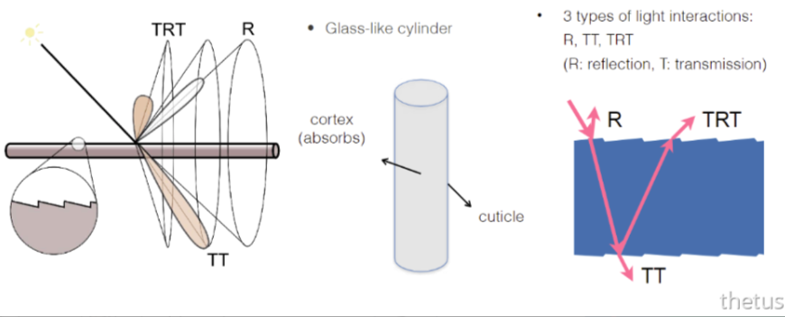

**双层圆柱模型**：模拟了光线经过髓质的效果，使用了五个分量来模拟毛发，在《猩球崛起》《狮子王》中得到应用。

#### 颗粒材质（Granular）

表面模型

#### Transluscent Material

应用：玉石、水母
反应在物理上，这种半透明材质说明了光线发生了**次表面散射**：

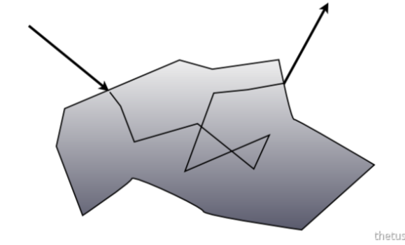

次表面散射BSSRDF可以看作是BRDF的延申，因为BSSRDF光线从一个点进入，会因为入射irradaince的不同而从不同点射出 BSSRDF：

$$S(x_i,\omega_i, x_0, \omega_0)$$

次表面散射BSSRDF会对表面上的所有点和所有方向进行积分

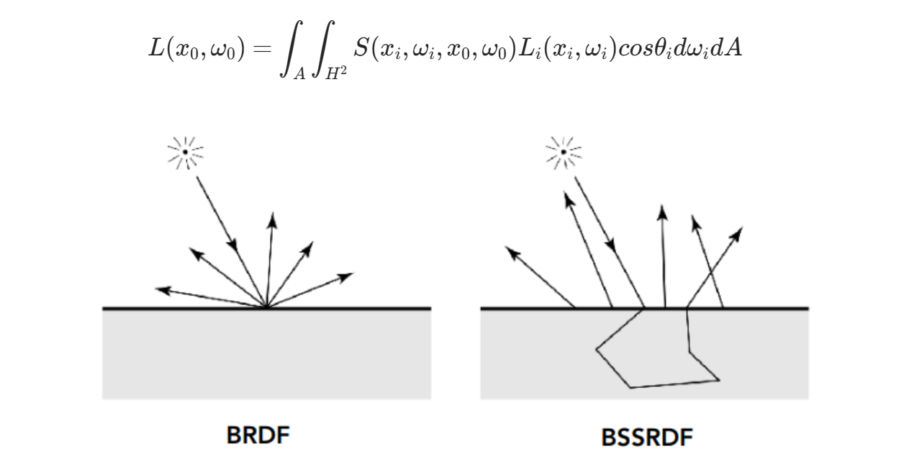

也可以用两个光源模拟次表面散射

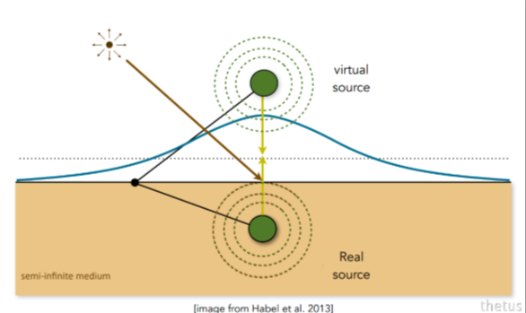

#### 布料材质

当成表面渲染，根据不同织法给出不同的BRDF。
如果当成表面渲染意味着我们没法渲染类似天鹅绒的材质。
也可以通过单根纤维的特性即分布推算出散射参数，向渲染云那样的散射介质一样来渲染布料，但计算量大。
也可以把每一根纤维都渲染出来，但计算量更大。

#### 细节模型

微表面模型中最重要的是它的法线分布，但是我们描述这个分布用的都是很简单的模型，比如正态分布之类的，真实的分布要更复杂。
真实的法线分布基本符合统计规律，但是又有一些细节

#### 波动光学

表面微小凸起干涉出彩色

#### 程序化生成外观

## Lecture 19 相机、镜头与光场

### 针孔相机

针孔只让每个物点的一条光线通过，因此成像永远是清晰的（无虚化），但进光量极少，需要很长的曝光时间。

| 特性           | 针孔相机          | 透镜相机       |
| -------------- | ----------------- | -------------- |
| 通光孔径       | 极小              | 较大（光圈）   |
| 每个物点的光线 | 近似一条          | 一大束         |
| 弥散圆大小     | 极小（≈针孔大小） | 随离焦程度变大 |
| 景深           | 极深（几乎无限）  | 可浅可深       |
| 虚化效果       | 几乎没有          | 可以有明显虚化 |

注意：**光栅化成像模型本质上就是针孔相机模型**，所以默认渲染出的图像处处清晰，想要景深效果必须显式模拟透镜。

### 视场FOV

FOV由**传感器尺寸 $h$** 和**焦距 $f$** 共同决定，可能指vertical也可能指horizontal，也可能指对角线。

$$
\mathrm{FOV} = 2\arctan\left(\frac{h}{2f}\right)
$$

- 传感器大小固定时，**焦距越短，FOV越大**（广角）；焦距越长，FOV越小（长焦，拍得远）。
- 焦距固定时，传感器越大，FOV越大。

### 焦距Focus Length

Focal Length 由于历史原因，通常指36 x 24 mm胶片（35mm全画幅）区域所对应的焦距，即**等效焦距**。

因此小传感器上标注的焦距要乘以裁切系数（crop factor）才能与全画幅比较：手机上的"等效28mm"并非真实的物理焦距。

### 传感器大小Sensor Size

- Sensor：记录irradiance的物理器件；Film / Image：最终存下来的图像。
- FOV相同时，传感器越大，可容纳的像素越多，单像素面积越大→信噪比越好。
- 同一焦距下换用更小的传感器 = 把画面裁掉一圈（FOV变小），并不等于"变焦"。

### 曝光Exposure

$$
H = T \times E
$$

- $H$：Exposure（曝光量，单位面积上累积的能量）
- $T$：Shutter Speed（快门时间，控制累积多久）
- $E$：Irradiance（单位面积的进光功率，由**光圈aperture**和**焦距focal length**决定）

因此同一曝光量可以由不同的 (光圈, 快门, ISO) 组合得到，但**副作用完全不同**（景深 / 运动模糊 / 噪声）。

### 相机可调内容

上图三行分别对应：**光圈**（影响景深虚化）、**快门**（影响运动模糊）、**ISO**（影响噪声）。

摄影上的"一档（one stop）"指曝光量翻倍或减半：光圈档位按 $\sqrt{2}$ 递进（F1.4→F2→F2.8→F4…，每档面积减半），快门与ISO则按2倍递进。

####  感光度ISO gain

调节从感光信号到电子信号的放大比率，可以是模拟增益也可以是数字增益。

数值上是线性的：ISO 200 的亮度是 ISO 100 的两倍。

ISO是**后处理式**的放大：信号和噪声一起被放大，因此过大会带来明显噪声，并不能凭空增加进光量。

#### 快门速度Shutter Speed

影响曝光时间。

副作用：

**运动模糊 Motion Blur**

快门开启期间物体移动，在传感器上留下拖影。

- 可以体现出速度感，不一定是缺点
- 本质是时间域上的一次积分（滤波），因此可以用于抗锯齿（类似于TAA）

**果冻效应 Rolling Shutter**

机械/电子快门通常是**逐行扫描**曝光的，不同扫描行记录的是不同时刻的场景，高速运动物体会被拍歪、断裂。

**机械快门、电子快门、全域快门**

由于电子快门需要逐像素（逐行）读出处理，因此读出时间变长，果冻效应更明显；全域快门（Global Shutter）所有像素同时曝光，没有果冻效应，但成本高。

#### 光圈Aperture

f-stop，写法 FN 或 F/N，N is the f-number。

非正式理解：**f-number 就是"1/光圈直径"**，数越小孔越大。

$$
N = \frac{f}{A} \quad \Longleftrightarrow \quad A = \frac{f}{N}
$$

其中 $f$ 为焦距，$A$ 为光圈（通光孔）直径。

进光量正比于光圈面积 $\propto A^2 \propto 1/N^2$，所以 F2.8 → F2 进光量翻倍。

光圈用于控制景深，快门用于控制运动模糊，两者对曝光的贡献可以互换，但视觉效果不可互换，需要做权衡。

#### 镜头

真实镜头由多片透镜组成，用来修正各种像差；理想化后用**薄透镜近似（Thin Lens Approximation）**：

- 透镜本身不会被光线弯折厚度所困扰，可任意改变焦距
- 平行于光轴的光线经过透镜后汇聚于焦点
- 光路可逆

薄透镜成像公式（Gauss / Thin Lens Equation）：

$$
\frac{1}{f} = \frac{1}{z_o} + \frac{1}{z_i}
$$

$z_o$ 为物距，$z_i$ 为像距。物体越近（$z_o$ 变小），像距 $z_i$ 越大——对焦就是在移动镜头/传感器使 $z_i$ 恰好落在传感器上。

#### Circle of Confusion

一个物点只有在"正确的像距"处才汇聚成一个点，如果传感器不在该像平面上，这束光在传感器上就摊成一个圆斑，即**弥散圆CoC**，表现为失焦模糊。

由相似三角形（图中 $A$ 为光圈直径，$C$ 为弥散圆直径，$d'$ 为像平面与传感器的偏移）：

$$
\frac{C}{A} = \frac{d'}{z_i} = \frac{|z_s - z_i|}{z_i}
$$

代入 $A = f/N$：

$$
C = A\,\frac{|z_s - z_i|}{z_i} = \frac{f}{N}\cdot\frac{|z_s - z_i|}{z_i}
$$

结论：

- CoC 正比于光圈直径 $A$，即**反比于f-number**。光圈越大（N越小）虚化越强
- 焦距越长，CoC 越大，虚化越强
- 离焦越远（$|z_s - z_i|$ 越大），虚化越强；完全合焦时 $C = 0$

因此想要更明显的虚化，应当用**大光圈 + 长焦距 + 靠近被摄物**。

#### 景深Depth of View

在焦平面前后的一段范围内，物体成像的弥散圆 $C$ 小于一个可接受阈值（通常取像素大小或人眼分辨极限），人眼看上去仍然是锐利的，这段深度范围就是**景深DOF**。

把传感器侧可接受的 CoC 阈值 $C$ 反投影回物方，得到景深的远近端 $D_F, D_N$：

$$
DOF = D_F - D_N
$$

即：**物方景深范围 = 像方可接受模糊范围经过薄透镜公式映射回去的结果**。

由 CoC 的结论可以直接读出景深的规律：

- 光圈越大（f-number越小）→ CoC越大 → **景深越浅**
- 焦距越长 → **景深越浅**
- 物距越近 → **景深越浅**

在光线追踪中模拟景深：不再从针孔发出一条光线，而是**在光圈上随机采样一点**，让光线经过该点并强制通过焦平面上对应的点，多次采样求平均，即可自然得到焦外模糊。

### 光场Light Field

**全光函数 Plenoptic Function**：描述"人在任意位置、朝任意方向、在任意时刻、任意波长能看到什么"，是一个7维函数

$$
P(\theta, \phi, \lambda, t, V_x, V_y, V_z)
$$

逐步简化：固定时间去掉 $t$，用RGB代替 $\lambda$，得到 $P(\theta,\phi,V_x,V_y,V_z)$（5维）。

**光场 = 全光函数在一个包围盒表面上的一部分**：任何物体都可以被一个包围盒围住，只要记录了包围盒表面上每个位置、每个方向的radiance，盒外任意视点看到的画面都能被还原出来。

参数化方式：面上一点用 $(u,v)$，方向用 $(\theta,\phi)$，或用**两平面法**——一条光线由两个平面上的交点 $(u,v)$ 与 $(s,t)$ 唯一确定，于是光场是**4维函数** $L(u,v,s,t)$。

- 固定 $(u,v)$ 看所有 $(s,t)$：相当于从一个点看整个物体（一张普通照片）
- 固定 $(s,t)$ 看所有 $(u,v)$：相当于从各个方向看物体上的同一个点

**光场相机 Light Field Camera（Lytro）**：在传感器前放置一层**微透镜阵列**，原本一个像素记录的"所有方向光线的总和（irradiance）"，被微透镜拆散成一个小块像素记录**各个方向的radiance**。

因此可以做到：

- **先拍照，后对焦（refocus）**：只需从记录的4D光场中重新挑选参与成像的光线子集
- 事后改变视角、光圈大小（改变参与积分的方向范围）

代价：

- 分辨率大幅下降——空间分辨率被"换"成了方向分辨率
- 需要极高的传感器像素数与复杂的设计，成本高

## Lecture 20 颜色和感知

## Lecture 21 动画与模拟

### 关键帧

给需要动画效果的属性，准备一组与时间相关的值，这些值都是在动画序列中比较关键的帧中提取出来的，而其他时间帧中的值，可以用这些关键值，采用特定的插值方法计算得到，从而达到比较流畅的动画效果。

- Keyframes 关键帧
- Tweens 插值帧

技术：插值（线性插值/曲线插值/样条插值）

### 物理模拟

物理模拟的应用：衣物模拟（碰撞检测）、流体模拟（先模拟再渲染）

### 质点弹簧系统

包含阻尼，基于胡克定律的质点弹簧系统

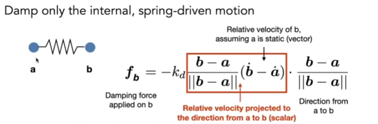

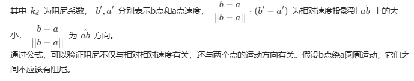

用质点弹簧系统模拟一块布

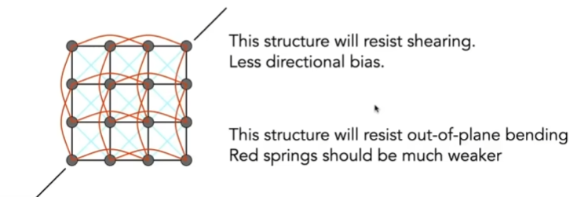

如图，其中考虑了抵抗切边的力（蓝色线条）和抵抗非平面（红色线条）的力。

### 有限元方法

用有限元来实现模拟效果

### 粒子系统

- 动态生成粒子（如果需要）

- 计算每个粒子受到的力 

    - 引力与斥力

    - 阻力

    - 摩擦力

- 更新每个粒子的位置和速度
- 移除不需要的粒子（如果需要）
- 渲染粒子

### 运动学（Kinematics）

#### 正向运动学

- Pin 钉子关节 （1D 旋转）
- Ball 球状关节 （2D 旋转）
- Prismatic joint （可以拉长或移动）

正向运动学通过关节的旋转计算出末端的运动，动画被描述为角度与时间的函数关系

#### 逆向运动学

使用逆向运动学，动画师提供末端的位置，计算机计算出满足约束条件的关节角度。

逆向运动学存在一个位置**多解或无解**的情况。

使用梯度下降法来寻找最优解

### 绑定（Rigging）

不同的两个动作可以使用Blend Shapes插值两个动作

### 动作捕捉（Motion Capture）

### 动画生成管线

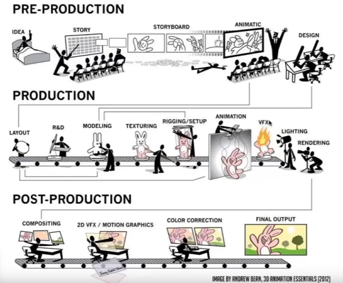

## Lecture 22 动画与模拟（继续1）

### 粒子模拟

速度场：一种函数，在任意时刻t和位置x，都有对应的速度取值 $v(x, t)$

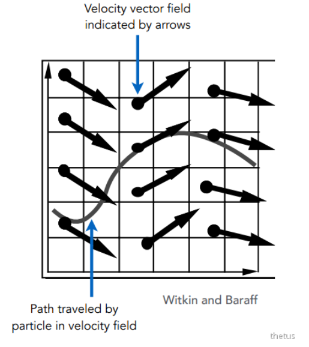

求解某个时刻粒子的位置实际上是求解常微分方程（ODE）：

$ \frac{dx}{dt} = x' = v(x, t)$

#### 欧拉方法

欧拉方法是一种数值求解方法，通过设定固定的时间间隔 $\Delta t$，对某一时刻的位置和速度进行递推更新：

$$
x^{t+\Delta t} = x^t + \Delta t \, \dot{x}^t
$$

$$
\dot{x}^{t+\Delta t} = \dot{x}^t + \Delta t \, \ddot{x}^t
$$

**特点与局限性**

- **依赖步长 $\Delta t$**：欧拉方法的精度和稳定性与所取的时间步长密切相关。
- **误差来源**：由于只利用当前时刻的信息进行线性近似，方法本身会引入累积误差。

**误差的影响**

- 当 $\Delta t$ 不够小时，计算结果 $x^{t+\Delta t}$ 会与实际值产生偏差。
- 在**物理模拟**中，这种误差可能导致结果不准确甚至**不稳定**的现象。
- 但在**渲染**（如动画或视觉效果）中，这种误差通常并不重要，视觉上的可接受性往往优先于物理精确性。

不稳定性：面对螺旋状等速度场，只要是取步长，就会产生问题，而且这些问题会被无限放大，即出现”正反馈“。
对于不稳定性，可能会加剧错误，在模拟中不能被忽视。

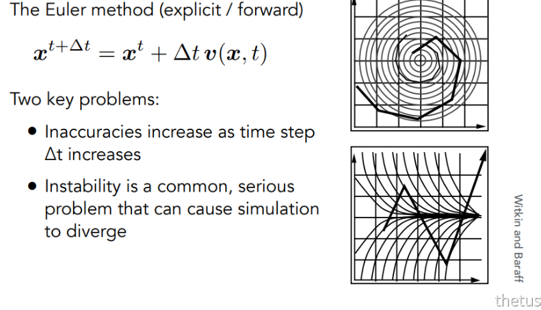

#### 改善不稳定性

 

##### 中点法

1. 按欧拉方法计算步长得到 a
2. 计算 a 点与初始点的中点的速度（位移的导数）
3. 按步骤 2 的速度更新初始点位置

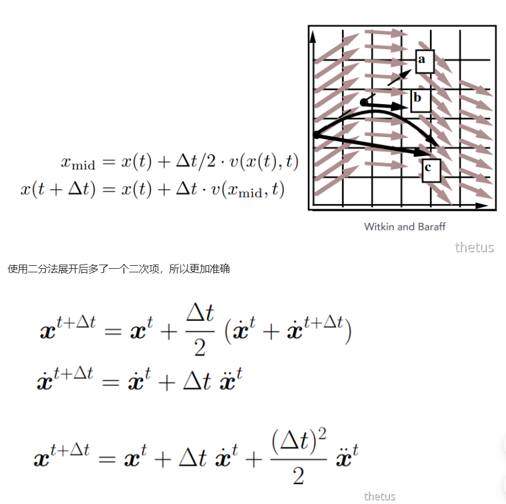

##### 自适应改变方法

1. 按欧拉方法计算步长得到位移$x_{T}$
2. 计算$x_{T}$与初始点中点的速度，并用这个速度更新得到$x_{T/2}$
3. 计算$|x_{T}-{x_{T}/2}|$
4. 如果结果大于阈值，则减少步长。

##### 隐式（后向）欧拉方法

- 使用欧拉公式时永远都使用下一个时间的速度与加速度
- 求解的时候并不好求，需要使用寻根算法如牛顿法
- 可以提供比较好的稳定性

#### 如何定义稳定性

如何定义稳定性？

- 通过研究局部截断误差和总体累积误差 来确定稳定性
- 我们通过阶数来判断稳定性，隐式的欧拉方法是1阶的，局部的截断误差为$O(h^{2})$，总体的积累误差为$O(h)$，这里h表示步长。 
    - 如果将h也就是$\Delta t$减小一半，那在全局上误差也会减小一半
    - 阶数越高越好，阶数越高减少h，那误差会减小的更多

##### 龙格库塔系列的方法(Runge-Kutta Families)

龙格库塔系列的方法擅长解常微分方程(ODE)，特别是非线性方程。
其中RK4（四阶）方法用的最多。

##### 非物理方法

基于位置的方法、Verlet积分等方法

- 优点：是快速而且简单
- 缺点：不是基于物理的，不能保证能量守恒

### 刚体模拟

刚体模拟（Rigid body simulation）不会发生形变，即刚体的内部都会以一种方式（趋势）进行运动，所以也可以把刚体模拟看成是粒子的扩充进行模拟：

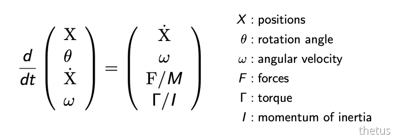

### 流体模拟（Fluid Simulation）

一种流体模拟的方法：

- 假设水由许多刚体小球组成
- 假设水不能被压缩
- 所以，只要某处的密度发生了变化，就应该通过改变粒子的位置来“修正”
- 为了修正，我们要知道一个小球位置的变化对其周围密度的影响，即任何一个点的密度梯度(也就是导数)
- 修正位置的过程是一个梯度下降的过程-  这样简单的模拟最后会一直运动停不下来，我们可以人为的加入一些能量损失

模拟大量物体运动的两种思路：

- 拉格朗日法（质点法）：以每个粒子为单位进行模拟
- 欧拉法（网格法）：以网格为单位进行分割模拟
- 混合法：粒子将属性传递给网格，模拟的过程在网格力做，然后把结果插值回粒子
